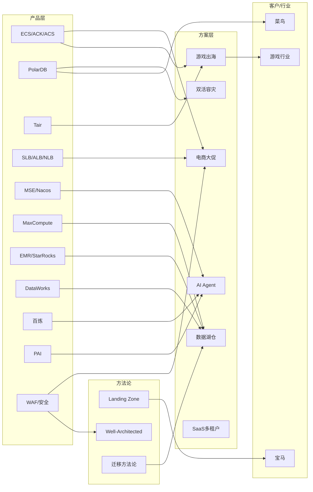

# Index — Wiki 内容目录

> **Karpathy LLM Wiki 核心导航文件**：The LLM reads the index first to find relevant pages, then drills into them.
> 本文件在每次 Ingest 后由 LLM 更新。按类目组织，每条含链接 + 一行摘要 + 来源数。

---

## 知识层（Knowledge — 动态，随蒸馏持续更新）

### 产品知识

| 页面 | 摘要 | 规模 |
|------|------|------|
| [knowledge/aliyun-products.md](knowledge/aliyun-products.md) | 68+ 产品能力卡（含 Meoo 独立卡 for Vibe Coding + ClickHouse 企业版/社区兼容版双线卡），13 行选型速查表 + 9 张决策树 | ~2170 行 |

### 场景方案

| 页面 | 摘要 | 规模 |
|------|------|------|
| [knowledge/cloud-solutions.md](knowledge/cloud-solutions.md) | 9 套高频场景方案（S1 电商大促 / S2 游戏出海 / S3 AI Agent / S4 双活 / S5 数据湖仓 / S6 视频 / S7 车联网 / S8 零售数据中台 / S9 SaaS 多租户），含升级阈值表 | ~1340 行 |

### 行业地图

| 页面 | 摘要 | 规模 |
|------|------|------|
| [knowledge/industry-landscape.md](knowledge/industry-landscape.md) | 7 张行业卡（互联网/金融/游戏/零售/教育/汽车/制造），含市场规模/痛点/合规/竞争格局 | ~470 行 |

### AI 趋势

| 页面 | 摘要 | 规模 |
|------|------|------|
| [knowledge/ai-trends.md](knowledge/ai-trends.md) | 百炼/PAI/通义/Qwen3.7 演进线，PD 分离实测数据，Agent 三层次模型，AI Infra 高可用模式，AIGC 内容生产矩阵，MaaS 商业模式分析，**Agent 知识工程**（LLM Wiki/Skillify/多对一编译/KBase实践），**Meoo Vibe Coding 分支** | ~282 行 |

### 客户画像

| 页面 | 摘要 | 规模 |
|------|------|------|
| [knowledge/company-profiles.md](knowledge/company-profiles.md) | 8 旗舰客户深度档案（南京银行/哈啰/一汽/B 站/启迪公交/51Talk/菜鸟）+ 200+ 国际客户索引 | ~290 行 |

### 竞品云情报

| 页面 | 摘要 | 规模 |
|------|------|------|
| [knowledge/competitor-cloud.md](knowledge/competitor-cloud.md) | AWS/Azure/GCP/腾讯/华为/火山引擎对位映射，AI 模型竞品矩阵（7 厂商 × 6 维），Winback 策略框架，游戏出海深度对比 | ~520 行 |

---

## 参考层（References — 静态框架，不随蒸馏变化）

| 页面 | 摘要 | 规模 |
|------|------|------|
| [references/well-architected.md](references/well-architected.md) | WAF 五大支柱 + 网络 WAD 七场景 + ACSG 六层纵深防御 | ~140 行 |
| [references/caf-landing-zone.md](references/caf-landing-zone.md) | CAF 六阶段 + 五大能力 + Landing Zone 六组件 | ~150 行 |
| [references/cloud-product-mapping.md](references/cloud-product-mapping.md) | 场景 × 产品矩阵速查（业务场景反查产品组合） | ~120 行 |
| [references/customer-playbook.md](references/customer-playbook.md) | 客户类型话术 + 决策时延层级（L1-L5） | ~100 行 |
| [references/architecture-templates.md](references/architecture-templates.md) | 高频架构模板（双活/出海/大数据/AIGC/Landing Zone/ADR） | ~310 行 |
| [references/migration-methodology.md](references/migration-methodology.md) | IDC→云迁移 4 阶段 + 6R 决策矩阵 + 工具链 + 风险清单 | ~380 行 |
| [references/bigdata-migration.md](references/bigdata-migration.md) | 大数据迁云专项（CDH→EMR/Hive→MC/Kafka/HDFS→OSS/Oracle→MC/Airflow→DataWorks） | ~510 行 |
| [references/pricing-verification-checklist.md](references/pricing-verification-checklist.md) | **报价前采购路径核验清单 v2**：12 条硬门禁（含 C11 版本可售性时效 + C12 Serverless 语义粒度）+ 6 个实战反面案例（CK 企业版/Hologres 网关/ADB 3 节点步长/RDS SQL Server Serverless 下线/PolarDB Serverless 不支持转包月/Flink 工作空间才停计费）+ § 3.1 全域速查表 v2（30+ DB/大数据/AI/存储产品）+ § 3.2 红色预警清单（11 条已下线/无法新购/不可转包月 SKU）+ § 3.3 匿名核验边界（common-buy 全登录墙 + 4 类必须登录复验字段） | ~350 行 |

---

## 管理层（Management）

| 文件 | 用途 |
|------|------|
| [knowledge/inbox.md](knowledge/inbox.md) | Raw 层注册入口 — 来源登记 + 状态机（pending→processing→done） |
| [changelog.md](changelog.md) | 时间线日志 — 每次 Ingest/Lint 的记录（等同 Karpathy 的 log.md） |
| [index.md](index.md) | 本文件 — Wiki 内容目录（等同 Karpathy 的 index.md） |

---

## 元层（Schema）

| 文件 | 用途 |
|------|------|
| [SKILL.md](SKILL.md) | 协议层 — 角色定义 + 工作模式 + 红线（等同 Karpathy 的 CLAUDE.md/AGENTS.md） |
| [README.md](README.md) | 设计说明 — 架构决策与演进路径 |

---

## 源层（Raw — 不可变原始资料）

| 目录 | 用途 | 当前状态 |
|------|------|----------|
| [raw/ata/](raw/ata/) | ATA 内部文章快照 | 11 篇已归档（含 SHA256） |
| [raw/aliyun-docs/](raw/aliyun-docs/) | help.aliyun.com / docs.meoo.com 文档片段 | 34 篇 Meoo 官方文档已归档（含 SHA256，2026-07-07） |
| [raw/customer-cases/](raw/customer-cases/) | 客户案例原始资料 | 待补充 |
| [raw/industry-reports/](raw/industry-reports/) | 行业报告、白皮书 | 待补充 |
| [raw/competitor/](raw/competitor/) | 竞品云公开资料 | 待补充 |
| [raw/misc/](raw/misc/) | 其他来源 | 1 篇已归档（百炼增速/突发限流机制，2026-07-16，含 SHA256） |

---

## 实体关系图（Mermaid）

---

## 交叉引用快查

以下为高频实体的跨文件出现位置：

| 实体 | 出现位置 |
|------|----------|
| PolarDB | aliyun-products / cloud-solutions(S4) / company-profiles(启迪/菜鸟) / competitor-cloud / bigdata-migration |
| 百炼 | aliyun-products(产品卡含增速/突发限流机制) / cloud-solutions(S3) / ai-trends / competitor-cloud(火山引擎) / raw/misc(限流机制内部文档) |
| ACK/ACS | aliyun-products / cloud-solutions(S2游戏) / architecture-templates / competitor-cloud |
| Landing Zone | caf-landing-zone / architecture-templates / company-profiles(宝马) |
| MaxCompute | aliyun-products / bigdata-migration / cloud-solutions(S5) |
| 出海 | cloud-solutions(S2) / competitor-cloud / industry-landscape(游戏) / architecture-templates |
| WAF/安全 | aliyun-products(安全域9产品) / well-architected(ACSG) / cloud-solutions(全场景安全章节) |
| Tair | aliyun-products / cloud-solutions(S2游戏) / competitor-cloud(ElastiCache对比) |
| 迁移 | migration-methodology / bigdata-migration / competitor-cloud(Winback) / aliyun-products(DataX) |
| DataWorks | aliyun-products / bigdata-migration(ETL调度) / cloud-solutions(S5数据湖仓) |
| EMR | aliyun-products / bigdata-migration(CDH→EMR) / cloud-solutions(S5) |
| EMR Serverless StarRocks | aliyun-products(独立深度卡) / cloud-solutions(S5湖仓加速层) / bigdata-migration(Impala→StarRocks) |
| Qwen/通义 | aliyun-products(AI域) / ai-trends(演进线) / competitor-cloud(模型矩阵) |
| SLB(CLB/ALB/NLB) | aliyun-products(网络域) / cloud-solutions(全场景负载均衡) / architecture-templates |
| MSE/Nacos | aliyun-products(中间件域，含四版本矩阵) / cloud-product-mapping(微服务化中型业务) / cloud-solutions(S3 AI Agent 注册发现) |

| 灵骏/Lingjun | ai-trends(PAI GPU定价) / aliyun-products(PAI产品卡) |

| Meoo/秒悟 | aliyun-products(AI域独立产品卡，Vibe Coding) / ai-trends(通义系列-Meoo) / raw/aliyun-docs/meoo(34 篇官方文档) |
| Vibe Coding | aliyun-products(Meoo 产品卡 + AI选型决策树分支) / ai-trends(通义系列) |
| ClickHouse | aliyun-products(独立双线卡：企业版 Serverless + 社区兼容版) / competitor-cloud(ByteHouse/CDW-CK 对位) / aliyun-products(EMR Serverless StarRocks 卡：选型分野) / references/pricing-verification-checklist(反面案例 1) |
| 采购路径核验 / 购买页硬门禁 | SKILL.md(模式B 第 6 步 + 模式C 红线 2) / references/pricing-verification-checklist(10 条清单 + 3 案例 + 速查表) / aliyun-products(ADB/Hologres/ClickHouse 卡的四字段) |

---

*最后更新：2026-08-05 — 🔧 采购路径闸门第二版（系统性核验完成）：subagent × 5 组并行核验 30+ DB/大数据/AI/存储产品；references/pricing-verification-checklist.md 扩到 ~350 行含 § 3.1 全域速查表 v2 + § 3.2 11 条红色预警清单 + § 3.3 匿名核验边界 + 案例 4/5/6（RDS SQL Server Serverless 下线 / PolarDB Serverless 不支持转包月 / Flink 无作业级 Serverless）+ 新增 C11/C12 核验项；tests/regression-cases.yaml v1.3 新增 PP01-PP10 采购路径专项 10 用例（主回归 36/36 全 PASS）；scripts/check-purchase-paths.py v1.0 哨兵首建（29 家族 + 6 结构 + 4 字段 = 100% PASS）；SKILL.md 模式G 补充哨兵/回归/Lint 三者互补关系；knowledge/aliyun-products.md 顶部指引改为"唯一权威来源指向 pricing-verification-checklist.md § 3.1"*
